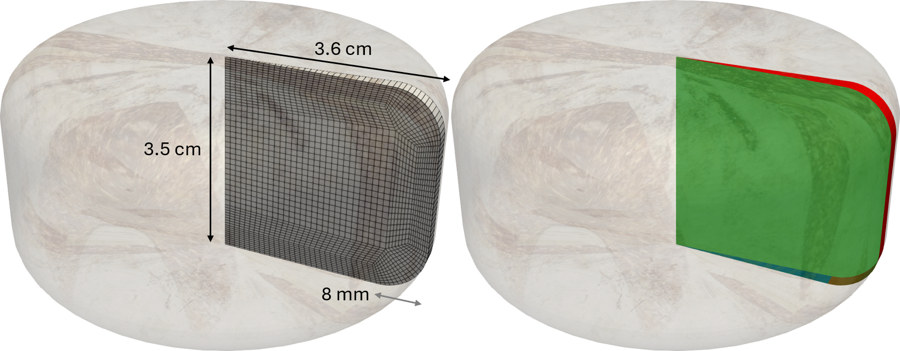
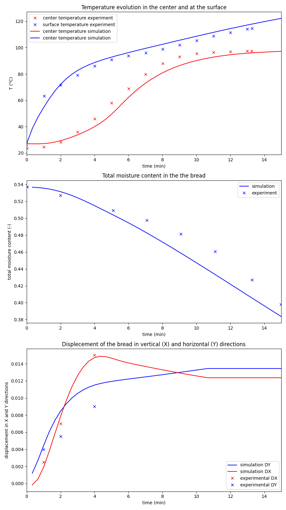
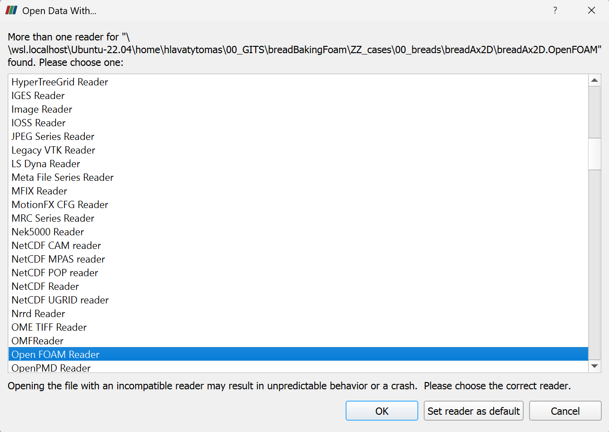
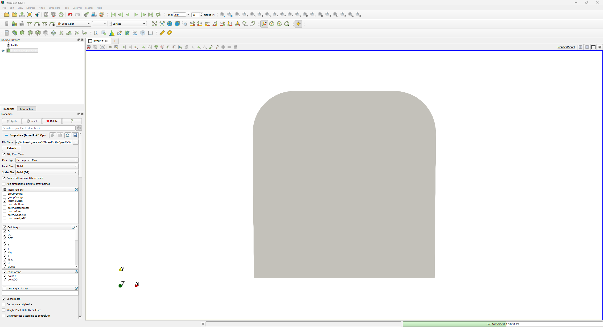
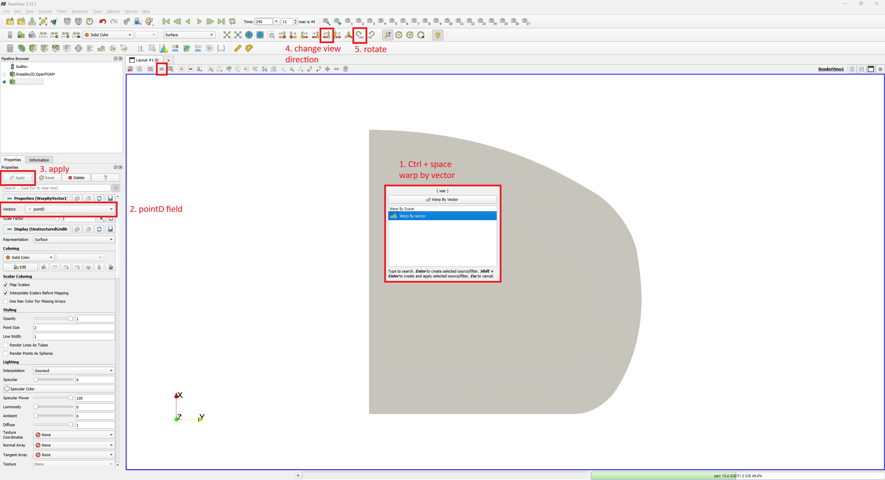
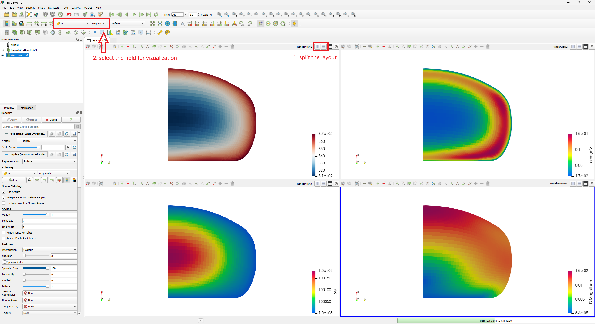

# 2D axisymmetric bread according to Zhang
## Case description and setup
This tutorial shows a two-dimensional internal simulation of the bread in the oven. External transport is resolved by custom mixed boundary conditions. The tutorial is located in `tutorials/breadAx2D` and can be:
1. run directly as prepared by `Allrun` script in `tutorials/breadAx2D` folder, or
2. modified and run by `pyCtrlScripts/runBreadAx2D.py` control script.

The description of the solved equations and variables is discussed in greater detail in https://doi.org/10.14311/TPFM.2025.015. In the solver, the main solved variables are:
* `moisture` - relative mass fraction of liquid water with respect to solid mass
* `T` - temperature,
* `pG` - pressure of the gas phase,
* `omegaV` - mass fraction of the water vapors in the gas,
* `omegaC` - mass fraction of the CO2 in the gas, and
* `D` - deformation vector. 

### Geometry and computational mesh description



Geometry for the tutorial is taken from the work of Zhang (https://doi.org/10.1002/aic.10518). The computational mesh is generated from `system/blockMeshDict`. A modified mesh can be generated by `pyCtrlScripts/runBreadAx2D.py` by changing the `'''Geometry parameters'''` section:
```
'''Geometry parameters'''
mSStep = 0.1e-2 # -- aproximate computational cell size
rLoaf = 3.6e-2  # -- loaf radius                
hLoaf = 3.5e-2  # -- loaf height
arcL = 0.008    # -- length of the arc at the side of the bread
```

The geometry has three boundary groups: `wedgeZ0` and `wedgeZE` are the wedge patches, while `bottom` and `sides` are the physical bread boundaries.

### Boundary conditions
The `wedgeZ0` and `wedgeZE` patches use the standard OpenFOAM _wedge_ condition. The physical `sides` and `bottom` patches use grouped boundary entries in the files under `0.org/`. The gas pressure `pG` uses _breadPGMixed_ with `pGInf = 1e5`, and the vapour mass fraction `omegaV` uses _breadOmegaVMixed_. The external mass-transfer coefficient `kM` and table names can be changed in `0.org/pG` and `0.org/omegaV`.

```
"(sides|bottom)"
{
    type breadOmegaVMixed;
    kM 0.01;

    refValue uniform 8e-3;
    refGradient uniform 0;
    valueFraction uniform 0;
    value uniform 8e-3;
    omegaVInfTableDict
    {
        file "$FOAM_CASE/constant/omegaVInfTable";
        outOfBounds warn;
    }
    DFieldName DEffvM;
}
```
The temporal evolution of water vapour in the oven is read from `constant/omegaVInfTable` as an OpenFOAM interpolation table. External heat transfer is specified with _breadTMixed_ in `0.org/T`.
``` 
"(sides|bottom)"
{
    type breadTMixed;
    refValue uniform 300;
    refGradient uniform 0;
    valueFraction uniform 0;
    value uniform 300;
    alpha 10;
    TInfTableDict
    {
        file "$FOAM_CASE/constant/TInfTable";
        outOfBounds warn;
    }
}
```
Here, `alpha` is the external heat-transfer coefficient and the baking curve is read from `constant/TInfTable`. For deformation, _breadDFloor_ is assigned to both physical patches, and the later `bottom` entry in `0.org/D` overrides the bottom condition with _fixedDisplacementZeroShear_. The side therefore remains controlled by _breadDFloor_.
```
"(sides)"
{
    type breadDFloor;
    floorPos -17.5e-3;
    refValue uniform (0 0 0);
    refGradient uniform (0 0 0);
    valueFraction uniform 1;
    value uniform 0;
}
```
This boundary condition acts as a solids4foam _solidTraction_ condition with zero traction and pressure until a face reaches `floorPos` in the vertical direction. That face then stops moving.

## Internal transport parameters
The internal transport parameters can be changed directly in `constant/transportProperties` and `constant/thermophysicalProperties`, or in the `'''Internal transport parameters'''` section of `pyCtrlScripts/runBreadAx2D.py`.

```
'''Internal transport parameters'''
DFree = 2.6e-5    # -- free volumetric diffusivity of water vapour in CO2 at 300 K
Dl = 5e-12        # -- liquid water diffusivity in the dough
tortOpen = 2.4    # -- tortuosity
tortClosed = 70   # -- tortuosity

lambdaS = 0.42    # -- heat conductivity at zero porosity

# -- intrinsic gas permeabilities of raw and baked bread
gasPermeabilityRaw = 4.5e-14
gasPermeabilityBaked = 1e-11

# -- heat capacities for the individual phases
CpS = 1130
CpG = 853
CpVapor = 1878
CpL = 4200

# -- mass density for the solid phase
rhoS = 507
```

`DFree` and `Dl` set the free gas and liquid-water diffusivities. The temperature and composition dependence of the effective gas diffusivity is calculated in the solver. `gasPermeabilityRaw` and `gasPermeabilityBaked` replace the older single `perm` parameter. `lambdaS` sets the heat conductivity at zero porosity. Specific heat capacities and solid density are changed through the corresponding `Cp` and `rho` parameters.

### Evaporation and fermentation
Evaporation is calculated with the Hertz-Knudsen equation, and fermentation kinetics is taken from equation (32) in https://doi.org/10.1002/aic.10518. The parameters can be changed in `constant/reactiveProperties` or in the `'''Evaporation and CO2 generation parameters'''` section of `pyCtrlScripts/runBreadAx2D.py`.
```
'''Evaporation and CO2 generation parameters'''
# -- evaporation / condensation coefficients in the Hertz-Knudsen equation
kMPCOpen = 0.015
kMPCClosed = 0.015

# -- Oswin-model parameters (legacy -- not used)
evCoef1 = -0.0056
evCoef2 = 4.5
n = 0.38

# -- CO2-generation kinetics parameters
R0 = 1.8e-2
Tm = 313
deltaT = 14
```
`kMPCOpen` and `kMPCClosed` set the evaporation coefficients in the Hertz-Knudsen formula. `evCoef1`, `evCoef2`, and `n` are retained for the legacy Oswin model. `R0`, `Tm`, and `deltaT` control the CO2-generation kinetics.

### Mechanical properties
Bread equilibrium shear and viscous moduli, Poisson ratio, and relaxation time can be changed directly in `constant/mechanicalProperties` or in the `'''Mechanical properties'''` section of `pyCtrlScripts/runBreadAx2D.py`.
```
'''Mechanical properties'''
withDeformation = 1 # -- turn on (1) / off (0) deformation
nu = 0.14
E = 30000
mu0Raw = 230
muV1Raw = 7400
bakedCoeff = 8
tau1 = 1.6
```

## Running the tutorial
The basic case can be run directly with `Allrun` in `tutorials/breadAx2D`. To generate a modified mesh, change parameters, run the simulation, and produce comparison data, use `pyCtrlScripts/runBreadAx2D.py`.
```
# CASE FOLDERS==========================================================
baseCaseDir = '../tutorials/breadAx2D/' # -- base case for simulation
outFolder = '../ZZ_cases/00_breads/008_newTau_tau_%g_Dl_%g_kOp_%g_kCl_%g_torOp_%g_torCl_%g_lambdaS_%g_R0_%g_perm_%g/' % (tau1, Dl, kMPCOpen, kMPCClosed, tortOpen, tortClosed, lambdaS, R0, gasPermeabilityRaw)

# WHAT SHOULD RUN=======================================================
prepBlockMesh = True    # -- preparation of the blockMeshDict script
makeGeom = True # -- creation of the geometry for computation
runDynSim = True    # -- run simulation
runPostProcess = True   # -- run post-processing

withKynuti = False     # -- optional preliminary temperature stage
```
`baseCaseDir` identifies the case template. The control script copies and modifies it under `outFolder`. It generates the mesh, runs the simulation, and then performs post-processing when the corresponding flags are `True`.

With the default `plusTime1 = 360` and `plusTime2 = 540`, the script first runs with deformation to 360 seconds and then continues to 900 seconds with `withDeformation` set to `0`. The default numerical settings are `timeStep = 0.25`, `writeInt = 10`, `nIter = 40`, and `nCores = 4`. Set `nCores = 1` for a serial run.

The optional `withKynuti` stage is disabled by default. When enabled, it adds a preliminary temperature-history run before the main simulation; configure `timeKynuti`, `TKynuti`, and `timeStepKynuti` in the control script.

### Parallel run
The tutorial is prepared to run in parallel. Change `nCores` in `pyCtrlScripts/runBreadAx2D.py` to the desired number of subdomains. Parallel post-processing uses `probeZhang` and `intMoisture`.

## Post-processing
### Prepared python post-processing
The `runBreadAx2D.py` script compares the results directly with Zhang’s experimental data and saves `postProcessingPlot.png` in the generated output case. It reads experimental data from `tutorials/breadAx2D/ZZ_dataForPostProcessing/`.



The resulting figure contains four plots: temperature at the centre and surface, total moisture, gas pressure, and deformation in the vertical and horizontal directions. The script also writes `temperatureProbe.dat` and `moisture.dat` to the generated output case.

### Paraview post-processing
To further examine the results, you can visualize them using paraview software. 
1. run the `paraview` (in this description we use Paraview 5.12.1),
2. open `breadAx2D.OpenFOAM` file, that was created during run of `Allrun` script or `pyCtrlScripts/runBreadAx2D.py`,
3. select open data with `Open FOAM Reader`,



4. select proper `Case Type` depending on type of your data (single core -> `Reconstructed Case`, parallel -> `Decomposed Case`, 
5. choose the desired `Time` for post-processing (e.g. 240), and
6. select `Apply`.



You will obtain such a visualization of the wedge computational mesh. Note that the problem is solved in Total Lagragian formulation, which means mesh is static and the effect of the deformation is resolved by the deformation gradient `F` and its Jacobian `J` in equations.

To vizualize the deformation 
1. press `Ctrl + space` and type `Warp By Vector`, which will apply `Warp By Vector` filter on your data,
2. under `Warp By Vector` filter properties select `pointD` field under `Vectors` to warp the geometry by this field, and click `Apply`,
3. change the view direction to `+Z` and rotate `+90 clockwise`,
4. select 2D interaction mode.



Now, you can split the layout and vizualize multiple variables at once.



Alternatively, you can load the prepared ParaView state at `tutorials/breadAx2D/ZZ_dataForPostProcessing/seeMultipleFields.pvsm`.
