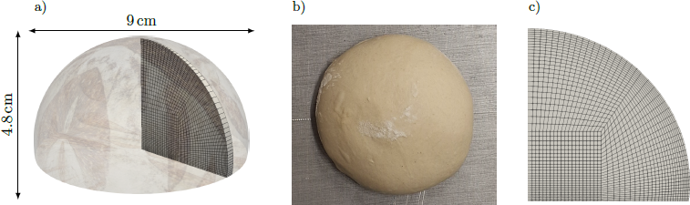

# 2D custom experiment with proofing
## Case description and setup
This tutorial shows a two-dimensional internal simulation of bread proofing and baking in our laboratory oven. External transport is resolved by custom mixed boundary conditions. The tutorial case is located in `tutorials/breadAx2DOurExp`. Its `Allrun` script runs the basic single-stage case; the proofing, deformable-baking, and non-deformable-baking stages described here are controlled by `pyCtrlScripts/runBread2DOurExpFreeBreadProofing.py`.

The description of the solved equations and variables is in greater detail discussed in https://doi.org/10.14311/TPFM.2025.015. Furthermore in the solver, the solved variables are noted as: 
* `moisture` - relative mass fraction of liquid water with respect to solid mass
* `T` - temperature,
* `pG` - pressure of the gas phase,
* `omegaV` - mass fraction of the water vapors in the gas,
* `omegaC` - mass fraction of the CO2 in the gas, and
* `D` - deformation vector. 

### Geometry and computational mesh description
Geometry is based on our custom experiments conducted in the laboratories at University of Chemistry and Technology. The two breads are simultaniously placed into oven to measure both the temperature evolution at several different places in the bread and the bread weight. 



The geometry for the tutorial is a two-dimensional wedge with the following patch groups:
* `wedgeZ0` and `wedgeZE` - wedge patches,
* `bottom` - the bottom boundary,
* `sides` - the bread side boundary, and
* `symmetryPatch` - the symmetry boundary.

### Boundary conditions
For the wedge and symmetry patches, standard OpenFOAM _wedge_ and _symmetry_ boundary conditions are used. For the mass transfer (`omegaV` and `omegaC`), the custom Robin boundary condition _breadOmegaVMixed_ is used on the `sides` and `bottom` patches. The boundary conditions can be changed in the corresponding files in `0.org/`. The external mass-transfer histories are read from `constant/omegaVInfTable` and `constant/omegaCInfTable`.

`0.org/omegaV`
```
boundaryField
{
    "symmetryPatch"
    {
        type symmetry;
    }

    sides
    {
        type breadOmegaVMixed;
        kM 0.01;
        refValue uniform 8e-3;
        refGradient uniform 0;
        valueFraction uniform 0;
        value uniform 8e-3;
        omegaVInfTableDict
        {
            file "$FOAM_CASE/constant/omegaVInfTable";
            outOfBounds warn;
        }
        DFieldName DEffvM;
    }

    bottom
    {
        type breadOmegaVMixed;
        kM 0.01;
        refValue uniform 8e-3;
        refGradient uniform 0;
        valueFraction uniform 0;
        value uniform 8e-3;
        omegaVInfTableDict
        {
            file "$FOAM_CASE/constant/omegaVInfTable";
            outOfBounds warn;
        }
        DFieldName DEffvM;
    }

    "(wedgeZ0|wedgeZE)"
    {
        type wedge;
    }
}
```

`0.org/omegaC`
```
boundaryField
{
    "symmetryPatch"
    {
        type symmetry;
    }

    sides
    {
        type breadOmegaVMixed;
        kM 0.01;
        refValue uniform 1e-3;
        refGradient uniform 0;
        valueFraction uniform 0;
        value uniform 1e-3;
        omegaVInfTableDict
        {
            file "$FOAM_CASE/constant/omegaCInfTable";
            outOfBounds warn;
        }
        DFieldName DEffcM;
    }

    bottom
    {
        type breadOmegaVMixed;
        kM 0.01;
        refValue uniform 1e-3;
        refGradient uniform 0;
        valueFraction uniform 0;
        value uniform 1e-3;
        omegaVInfTableDict
        {
            file "$FOAM_CASE/constant/omegaCInfTable";
            outOfBounds warn;
        }
        DFieldName DEffcM;
    }

    "(wedgeZ0|wedgeZE)"
    {
        type wedge;
    }
}
```

For pressure, a fixed Dirichlet value equal to `$internalField` is prescribed on `sides` and `bottom`.

`0.org/pG`

```
boundaryField
{
    "symmetryPatch"
    {
        type symmetry;
    }

    sides
    {
        type fixedValue;
        value $internalField;
    }
    "(wedgeZ0|wedgeZE)"
    {
        type wedge;
    }
    bottom
    {
        type fixedValue;
        value $internalField;
    }
}
```
Similarly, external heat transfer is approximated by _breadTMixed_ in `0.org/T`. The `sides` and `bottom` patches use separate interpolation tables.
``` 
boundaryField
{
    "symmetryPatch"
    {
        type symmetry;
    }

    sides
    {
        type breadTMixed;
        refValue        uniform 300;
        refGradient     uniform 0;
        valueFraction   uniform 0;
        value           uniform 300;
        alpha           10;
        TInfTableDict   
        {
            file "$FOAM_CASE/constant/TInfTable";
            outOfBounds warn;
        }
    }

    bottom
    {
        type breadTMixed;
        // type breadTBottom;
        refValue        uniform 300;
        refGradient     uniform 0;
        valueFraction   uniform 0;
        value           uniform 300;
        alpha           10;
        TInfTableDict   
        {
            file "$FOAM_CASE/constant/TInfTableBottom";
            outOfBounds warn;
        }
    }
    "(wedgeZ0|wedgeZE)"
    {
        type wedge;
    }
}
```

Here, `alpha` is the external heat transfer coefficient. The baking curves are generated by the control script in `constant/TInfTable` and `constant/TInfTableBottom`. For deformation, _fixedDisplacementZeroShear_ is used on `bottom`, while _breadDFloor_ is used on `sides`.

```
"(sides)"
{
    type breadDFloor;
    floorPos 1e-5;
    sidePos 0;
    refValue        uniform (0 0 0);
    refGradient     uniform (0 0 0);
    valueFraction   uniform 1;
    value           uniform 0;
}
```
This boundary condition acts as solids4foam _solidTraction_ boundary condition with zero traction and pressure, until the `sidePos` in the horizontal dimension is reached by some face. Then, this face does not move anymore.  

Alternatively, you can change external heat and mass transfer coefficients for all the boundaries in `'''Boundary conditions'''` section of the  `pyCtrlScripts/runBread2DOurExpFreeBreadProofing.py` control script.
```
'''Boundary and initial conditions'''
TProofing = 301
TStart = 298
TTop = 200
TBottom = 200

kMSidesOmega = 0.01 # -- external mass transfer coeficient 
kMBottomOmega = 0.01

alphaG = 10 # -- external heat transfer coeficient 
alphaGBottom = 14
```

### Internal transfer parameters
The parameters for the internal transfer in the bread can be changed directly in the `constant/transportProperties` and `constant/thermophysicalProperties` or in `'''Internal transport parameters'''` section of the control python script (`pyCtrlScripts/runBread2DOurExpFreeBreadProofing.py`).

```
'''Internal transport parameters'''
DFree = 2.6e-5    # -- free volumetric diffusivity of water vapour in CO2 at 300 K
Dl = 6e-11       # -- liquid water diffusivity in the dough
tortOpen = 2.4   # -- tortuosity
tortClosed = 70  # -- tortuosity (not used)

# -- heat conductivity of the dough material with porosity 0
lambdaS = 0.42

# -- intrinsic gas permeabilities of raw and baked bread
gasPermeabilityRaw = 0.9e-15
gasPermeabilityBaked = 1e-11

# -- heat capacities for the individual phases
CpS = 1130
CpG = 853
CpVapor = 1878
CpL = 4200

# -- mass density for the solid phase
rhoS = 865

# -- initial dough volumetric fraction
alphaD0 = 0.91
if not proofing:
    alphaD0 = 0.43
    rhoS = 1387
```

`DFree` and `Dl` set the free gas and liquid-water diffusivities. The temperature and composition dependence of the effective gas diffusivity is calculated in the solver. `gasPermeabilityRaw` and `gasPermeabilityBaked` replace the older single `perm` parameter. `lambdaS` sets the heat conductivity of the dough material with zero porosity. Specific heat capacities and mass density are changed through the corresponding `Cp` and `rho` parameters.

### Evaporation and fermentation
Evaporation is calculated using the Hertz-Knudsen equation. Fermentation kinetics is taken from equation (32) in https://doi.org/10.1002/aic.10518. The parameters can be changed in `constant/reactiveProperties` or in the `'''Evaporation and CO2 generation parameters'''` section of the control script.
```
'''Evaporation and CO2 generation parameters'''
# -- evaporation / condensation coefficients in the Hertz-Knudsen equation
kMPCOpen = 0.01
kMPCClosed = 0.01

# -- Oswin-model parameters (legacy -- not used)
evCoef1 = -0.0071
evCoef2 = 4.5
n = 0.38

# -- CO2-generation kinetics parameters
R0 = 2.3e-3
Tm = 313
deltaT = 14
```
`kMPCOpen` and `kMPCClosed` set the evaporation coefficients in the Hertz-Knudsen formula. `evCoef1`, `evCoef2`, and `n` are retained for the legacy Oswin model. Finally, `R0`, `Tm`, and `deltaT` control the CO2-generation kinetics.

### Mechanical properties
Bread equilibrium shear and viscous moduli, Poisson ratio, and relaxation time can be changed directly in `constant/mechanicalProperties` or in the `'''Mechanical properties'''` section of the control script.
```
'''Mechanical properties'''
withDeformation = 1 # -- turn on (1) / off (0) deformation

nu = 0.14
E = 30000       # -- legacy parameter, not used by the current model
mu0Raw = 147
muV1Raw = 7400
bakedCoeff = 25
tau1 = 1.6
```

## Running the tutorial
The basic case can be run directly with `Allrun` in `tutorials/breadAx2DOurExp`. Use `pyCtrlScripts/runBread2DOurExpFreeBreadProofing.py` for the staged proofing and baking workflow described in this tutorial.
```
# CASE FOLDERS==========================================================
baseCaseDir = '../tutorials/breadAx2DOurExp/' # -- base case for simulation
outFolder = '../ZZ_cases/01_breadAx2DOurExp/'

# WHAT SHOULD RUN=======================================================
prepBlockMesh = True    # -- preparation of the blockMeshDict script
makeGeom = True # -- creation of the geometry for computation
runDynSim = True    # -- run simulation
runPostProcess = True   # -- run post-processing

proofing = True  # -- include the proofing stage
```
`baseCaseDir` identifies the case template. The control script copies and modifies it under `outFolder`. With `proofing = True`, the default workflow runs a 2400-second proofing stage, a 450-second deformable baking stage, and a 750-second non-deformable baking stage. Set `proofing = False` only when intentionally running the baking-only variant.

The script prepares the mesh, runs `breadBakingFoam` in up to three stages, and updates `controlDict` and `fvSolution` between stages. The default script uses `nCores = 8`; set `nCores = 1` for a serial run.

### Parallel run
The tutorial is prepared to run in parallel. Change `nCores` in `pyCtrlScripts/runBread2DOurExpFreeBreadProofing.py` to the desired number of subdomains. Parallel post-processing also requires the `TLFProbe`, `intMoisture`, and `getBoundPoints` utilities built by the repository.

## Post-processing

When `runPostProcess = True`, the control script reads experimental data from `tutorials/breadAx2DOurExp/ZZ_dataForPostProcessing/`, probes the computed fields, integrates moisture and boundary points, and writes comparison plots to `outFolder`.