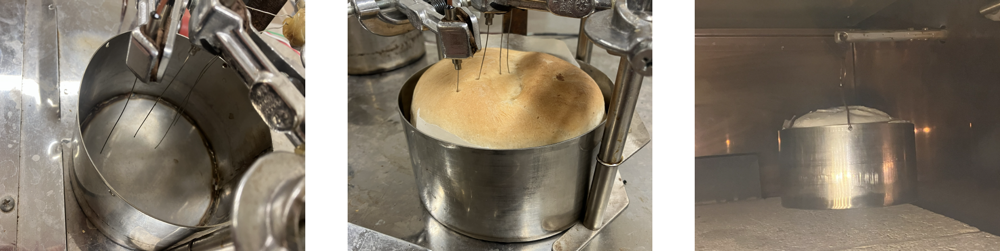
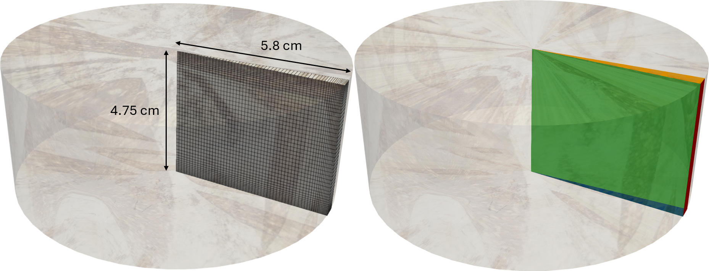

# 2D our custom experiment
## Case description and setup
This tutorial shows a two-dimensional internal simulation of the bread in our laboratory oven. External transport is resolved by custom mixed boundary conditions. The tutorial is located in `tutorials/breadAx2D` and can be:
1. run directly as prepared by `Allrun` script in `tutorials/breadAx2DOurExp` folder, or
2. modified and run by `pyCtrlScripts/runBreadAx2DOurExp.py` control script.

The description of the solved equations and variables is in greater detail discussed in https://doi.org/10.14311/TPFM.2025.015. Furthermore in the solver, the solved variables are noted as: 
* `alphaI` - volumetric fraction of the I-th phase,
* `T` - temperature,
* `pG` - pressure of the gas phase,
* `omegaV` - mass fraction of the water vapors in the gas, and
* `D` - deformation vector. 

### Geometry and computational mesh description
Geometry is based on our custom experiments conducted in the laboratories at University of Chemistry and Technology. The two breads are simultaniously placed into two tin cans to measure both the temperature evolution at several different places in the bread and the bread weight. 



The geometry for the tutorial is taken as a simple wedge with four different boundaries:
* wedge (depicted in green),
* bottom (depicted in blue), 
* side (depicted in red), and
* top (depicted in orange).



### Boundary conditions
For the wedge boundary, we prescribe standard OpenFOAM _wedge_ boundary condition for all the variables. For the mass transfer (`pG` and `omegaV` variables), we prepared custom Robin external mass transfer boundary conditions _breadPGMixed_ and _breadOmegaVMixed_, respectively. The boundary conditions can be changed similarly as in other OpenFOAM software in `0.org/` directory. The boundary condition for the bottom, side and top patches differ only in the external mass transfer coefficient `kM`. Furthermore, the temporal evolution of the water vapors in oven can be changed in `constant/omegaVInfTable` as standard OpenFOAM interpolation table.

`0.org/omegaV`
```
sides
{
    type breadOmegaVMixed;
    kM               6e-4; // -- heat transfer coefficient

    // -- mixed BC mandatory entires
    refValue        uniform 7.7e-3;
    refGradient     uniform 0;
    valueFraction   uniform 0;
    value           uniform 7.7e-3;
    omegaVInfTableDict   
    {
        file "$FOAM_CASE/constant/omegaVInfTable";
        outOfBounds warn;
    }
}
top
{
    type breadOmegaVMixed;
    kM               0.01; // -- heat transfer coefficient
    // -- mixed BC mandatory entires
    refValue        uniform 7.7e-3;
    refGradient     uniform 0;
    valueFraction   uniform 0;
    value           uniform 7.7e-3;
    omegaVInfTableDict   
    {
        file "$FOAM_CASE/constant/omegaVInfTable";
        outOfBounds warn;
    }
}
bottom
{
    type breadOmegaVMixed;
    kM               3e-4; // -- heat transfer coefficient
    // -- mixed BC mandatory entires
    refValue        uniform 7.7e-3;
    refGradient     uniform 0;
    valueFraction   uniform 0;
    value           uniform 7.7e-3;
    omegaVInfTableDict   
    {
        file "$FOAM_CASE/constant/omegaVInfTable";
        outOfBounds warn;
    }
}
```

`0.org/pG`
```
sides
{
    type breadPGMixed;
    kM               6e-4; // -- heat transfer coefficient
    pGInf        1e5;    // -- oven temperature
    // -- mixed BC mandatory entires
    refValue        uniform 1e5;
    refGradient     uniform 0;
    valueFraction   uniform 0;
    value           uniform 1e5;
}

top
{
    type fixedValue;
    value $internalField;
}

bottom
{
    type breadPGMixed;
    kM               3e-4; // -- heat transfer coefficient
    pGInf        1e5;    // -- oven temperature
    // -- mixed BC mandatory entires
    refValue        uniform 1e5;
    refGradient     uniform 0;
    valueFraction   uniform 0;
    value           uniform 1e5;
}
```
Similarly for the temperature, the external transport in the oven is approximated by the custom Robin boundary condition which is assumed to be same at all boundaries and can be changed in `0.org/T`.
``` 
"(sides|bottom|top)"
{
    type breadTMixed;
    refValue        uniform 302;
    refGradient     uniform 0;
    valueFraction   uniform 0;
    value           uniform 302;
    alpha           9.5;
    TInfTableDict   
    {
        file "$FOAM_CASE/constant/TInfTable";
        outOfBounds warn;
    }
}
```

Here, `alpha` is the external heat transfer coefficient, and again, the temporal evolution of the oven temperature (i.e. baking curve) can be set in `constant/TInfTable` as OpenFOAM interpolation table. Finally, the _fixedDisplacementZeroShear_ boundary condition is prescribed for the deformation at the bottom  and side patches, and the custom _breadDSide_ boundary condition is prescribed for the top patch.

```
top
{
    type            breadDSide;
    sidePos         5.8e-2;
    refValue        uniform (0 0 0);
    refGradient     uniform (0 0 0);
    valueFraction   uniform 1;
    value           uniform 0;
}
```
This boundary condition acts as solids4foam _solidTraction_ boundary condition with zero traction and pressure, until the `sidePos` in the horizontal dimension is reached by some face. Then, this face does not move anymore.  

### Internal transfer parameters
The parameters for the internal transfer in the bread can be changed directly in the `constant/transportProperties` and `constant/thermophysicalProperties` or in `'''Internal transport parameters'''` section of the control python script (`pyCtrlScripts/runBreadAx2DOurExp.py`).

```
'''Internal transport parameters'''
# -- free volumetric difusivity of the water vapors in CO2 at 300 K
DFree = 2.22e-6 

# -- heat conductivity of the dough material with porosity 0, i.e. the 
# -- absolute term in equation (5) in 
# -- https://doi.org/10.1016/j.fbp.2008.04.002
lambdaS = 0.447 

perm = 0.9e-12  # -- bread permeability 

# -- heat capacities for the individual phases
CpS = 700   # -- solid phase
CpG = 853  # -- CO2
CpVapor = 1878 # -- water vapors
CpL = 4200  # -- liquid phase

# -- mass densities for the individual phases
rhoS = 700  # -- solid density    
rhoL = 1000  # -- liquid density   
```

`DFree` parameter sets up the free volumetric diffusivity of the water vapors in carbon dioxide. The temperature and composition dependence of the effective diffusivity is then calculated directly in the solver. `lambdaS` sets up the heat conductivity of the dough material with zero porosity, i.e. the absolute term in equation (5) in https://doi.org/10.1016/j.fbp.2008.04.002 that is used for calculation of the effective heat conductivity. Specific heat capacities and mass densities can be then changed by `Cp` and `rho` parameters.

### Evaporation and fermentation
Evaporation is calculated using Hertz-Knudsen equation while the needed water activity is calculated using Oswin model with parameters measured in https://doi.org/10.1016/0260-8774(91)90020-S. Fermentation kinetics is taken directly from equation (32) in https://doi.org/10.1002/aic.10518. The parameters for all the relations for evaporation and fermentation evaluation can be changed in `constant/reactiveProperties` file or in `'''Evaporation and CO2 generation parameters'''` section of the control python script (`pyCtrlScripts/runBreadAx2DOurExp.py`).
```
'''Evaporation and CO2 generation parameters'''
# -- evaporation / condensation coeficient in Hertz-Knudsen equation
kMPC = 0.42

# -- parameters for Oswin model (https://doi.org/10.1016/0260-8774(91)90020-S)
evCoef1 = -0.0056
evCoef2 = 5.5

# -- pre-exponential factor and Tm in CO2 generation kinetics 
# -- in equation (32) in https://doi.org/10.1002/aic.10518
R0 = 22e-4 
Tm = 314
```
`kMPC` sets up the evaporation coefficient in the Hertz-Knudsen formula. `evCoef1` and `evCoef` are the coefficients for the Oswin model for water activity. Finally, `R0` and `Tm` are the pre-exponential factor and temperature of the fermentation maximum in CO2 generation kinetics.

### Mechanical properties
Bread Youngs modulus and Poisson ratio can be changed directly in `constant/mechanicalProperties` file or in `'''Mechanical properties'''` section of the control python script (`pyCtrlScripts/runBreadAx2DOurExp.py`).
```
'''Mechanical properties'''
withDeformation = 1 # -- turn on (1) /off (0) deformation
nu = 0.15   # -- Poisson ratio
E = 12000   # -- Youngs modulus
```

## Running the tutorial
As written above, the tutorial can be either run directly by `Allrun` script in tutorial directory `tutorials/breadAx2DOurExp` or by control python script `pyCtrlScripts/runBreadAx2DOurExp.py` which allows further setup. 
```
# CASE FOLDERS==========================================================
baseCaseDir = '../tutorials/breadAx2DOurExp/' # -- base case for simulation
outFolder = '../ZZ_cases/00_breads/breadAx2DOurExp/'

# WHAT SHOULD RUN=======================================================
prepBlockMesh = True    # -- preparation of the blockMeshDict script
makeGeom = True # -- creation of the geometry for computation
runDynSim = True    # -- run simulation
runPostProcess = True   # -- run post-processing
```
`baseCaseDir` sets up the tutorial directory, `outFolder` specifies path where the tutorial will be copied, modified and run. 

### Parallel run
The tutorial is prepared to run also in parallel. It is possible to run it by changing `nCores` parameter in `pyCtrlScripts/runBreadAx2DOurExp.py` to number higher than 1.

## Post-processing
### Prepared python post-processing
For the post-processing, it is possible to use prepared `pyCtrlScripts/runBreadAx2DOurExp.py` script, which compares the results directly with the experimental data by the generation of the following figure. 


The resulting post-processing figure consists of three plots. In the first of them the comparison of the temperature evolution in three different points for the simulation and experiment is depicted. Experimental data are loaded from `ZZ_dataForPostProcessing` directory in the tutorial. In the second plot, the total moisture content in the bread for the simulation and experiment is compared. Finally, in the third plot, the comparison of the simulation and experimental deformation at the bread top is compared.

### Paraview post-processing
To further examine the results, you can visualize them using paraview software. 
1. run the `paraview` (in this description we use Paraview 5.12.1),
2. open `runBreadAx2DOurExp.OpenFOAM` file, that was created during run of `Allrun` script or `pyCtrlScripts/runBreadAx2DOurExp.py`,
3. select open data with `Open FOAM Reader`,