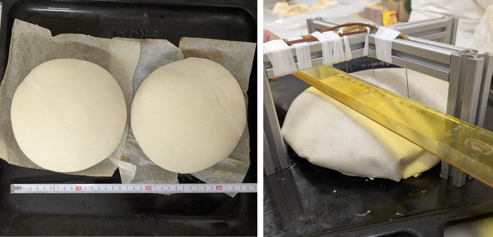
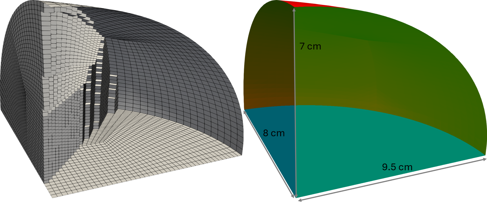

# 3D our custom experiment
## Case description and setup
This tutorial shows a three-dimensional internal simulation of the bread in our laboratory oven. External transport is resolved by a custom mixed boundary conditions. The tutorial is located in `tutorials/bread3DOurExp` and can be:
1. run directly as prepared by `Allrun` script in `tutorials/bread3DOurExp` folder, or
2. modified and run by `pyCtrlScripts/runBread3DOurExp.py` control script.

The description of the solved equations and variables is in greater detail discussed in https://doi.org/10.14311/TPFM.2025.015. Furthermore in the solver, the solved variables are noted as: 
* `alphaI` - volumetric fraction of the I-th phase,
* `T` - temperature,
* `pG` - pressure of the gas phase,
* `omegaV` - mass fraction of the water vapors in the gas, and
* `D` - deformation vector. 

### Geometry and computational mesh description
Geometry is based on our custom experiments conducted in the laboratories at University of Chemistry and Technology. The two breads are simultaniously placed into oven to measure both the temperature evolution at several different places in the bread and the bread weight.



Unlike the second tutorial on our custom 2D experiments, the present tutorial shows capability of the developed software to work with three-dimensional geometry. In particular, we work with the quater of the elipsoic bread as depicted in the following figure.



The computational mesh is prepared using `system/blockMeshDict`, which is pre-prepared in the tutorial case. `blockMeshDict` file with the modified dimesions (both radia and height) or the computational cell size can be generated using `pyCtrlScripts/runBread3DOurExp.py` script by changing `'''Geometry parameters'''` part:
```
'''Geometry parameters'''
mSStep = 0.15e-2 # -- aproximate computational cell size
rLoaf1 = 8.5e-2  # -- loaf radius                
rLoaf2 = 8.0e-2  # -- loaf radius                
hLoaf = 7e-2  # -- loaf height 
```

There are three diferent types of the geometry boundaries:
* symmetry (depicted in green),
* bottom (depicted in blue), and 
* side (depicted in red).


## Internal transfer parameters
The parameters for the internal transfer in the bread can be changed directly in the `constant/transportProperties` and `constant/thermophysicalProperties` or in `'''Internal transport parameters'''` section of the control python script (`pyCtrlScripts/runBreadAx2D.py`).

```
'''Internal transport parameters'''
# -- free volumetric difusivity of the water vapors in CO2 at 300 K
DFree = 2.22e-6 

# -- heat conductivity of the dough material with porosity 0, i.e. the 
# -- absolute term in equation (5) in 
# -- https://doi.org/10.1016/j.fbp.2008.04.002
lambdaS = 0.447 

perm = 0.9e-12  # -- bread permeability 

# -- heat capacities for the individual phases
CpS = 700   # -- solid phase
CpG = 853  # -- CO2
CpVapor = 1878 # -- water vapors
CpL = 4200  # -- liquid phase

# -- mass densities for the individual phases
rhoS = 700  # -- solid density    
rhoL = 1000  # -- liquid density   
```

`DFree` parameter sets up the free volumetric diffusivity of the water vapors in carbon dioxide. The temperature and composition dependence of the effective diffusivity is then calculated directly in the solver. `lambdaS` sets up the heat conductivity of the dough material with zero porosity, i.e. the absolute term in equation (5) in https://doi.org/10.1016/j.fbp.2008.04.002 that is used for calculation of the effective heat conductivity. Specific heat capacities and mass densities can be then changed by `Cp` and `rho` parameters.

### Evaporation and fermentation
Evaporation is calculated using Hertz-Knudsen equation while the needed water activity is calculated using Oswin model with parameters measured in https://doi.org/10.1016/0260-8774(91)90020-S. Fermentation kinetics is taken directly from equation (32) in https://doi.org/10.1002/aic.10518. The parameters for all the relations for evaporation and fermentation evaluation can be changed in `constant/reactiveProperties` file or in `'''Evaporation and CO2 generation parameters'''` section of the control python script (`pyCtrlScripts/runBreadAx2D.py`).
```
'''Evaporation and CO2 generation parameters'''
# -- evaporation / condensation coeficient in Hertz-Knudsen equation
kMPC = 0.42

# -- parameters for Oswin model (https://doi.org/10.1016/0260-8774(91)90020-S)
evCoef1 = -0.0056
evCoef2 = 5.5

# -- pre-exponential factor and Tm in CO2 generation kinetics 
# -- in equation (32) in https://doi.org/10.1002/aic.10518
R0 = 22e-4 
Tm = 314
```
`kMPC` sets up the evaporation coefficient in the Hertz-Knudsen formula. `evCoef1` and `evCoef` are the coefficients for the Oswin model for water activity. Finally, `R0` and `Tm` are the pre-exponential factor and temperature of the fermentation maximum in CO2 generation kinetics.

### Mechanical properties
Bread Youngs modulus and Poisson ratio can be changed directly in `constant/mechanicalProperties` file or in `'''Mechanical properties'''` section of the control python script (`pyCtrlScripts/runBreadAx2D.py`).
```
'''Mechanical properties'''
withDeformation = 1 # -- turn on (1) /off (0) deformation
nu = 0.15   # -- Poisson ratio
E = 12000   # -- Youngs modulus
```

## Running the tutorial
As written above, the tutorial can be either run directly by `Allrun` script in tutorial directory `tutorials/breadAx2D` or by control python script `pyCtrlScripts/runBreadAx2D.py` which allows further setup. 
```
# CASE FOLDERS==========================================================
baseCaseDir = '../tutorials/breadAx2D/' # -- base case for simulation
outFolder = '../ZZ_cases/00_breads/breadAx2D/'

# WHAT SHOULD RUN=======================================================
prepBlockMesh = True    # -- preparation of the blockMeshDict script
makeGeom = True # -- creation of the geometry for computation
runDynSim = True    # -- run simulation
runPostProcess = True   # -- run post-processing
```
`baseCaseDir` sets up the tutorial directory, `outFolder` specifies path where the tutorial will be copied, modified and run. 

### Parallel run
The tutorial is prepared to run also in parallel. It is possible to run by changing `nCores` parameter in `pyCtrlScripts/runBreadAx2D.py` to number higher than 1.
